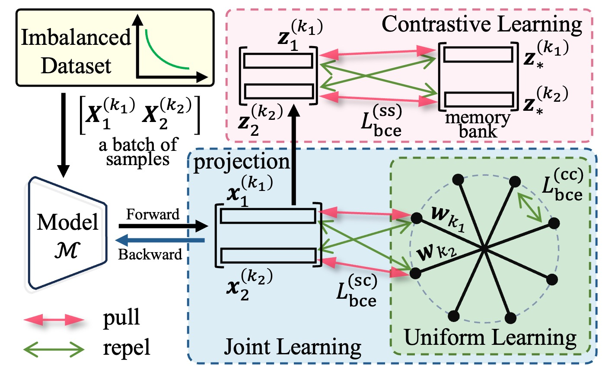

# \[AAAI 2026 Poster\] BCE3S: Binary Cross-entropy based Tripartite Synergistic Learning for Long-tailed Recognition
This is the offcial repo for paper "BCE3S: Binary Cross-entropy based Tripartite Synergistic Learning for Long-tailed Recognition"

# Paper coming soon~

# Overview
<!--  -->


# Run
## Requirements
```shell
git clone https://github.com/WakingHours-GitHub/BCE3S.git
cd BCE3S
```
Install dependency
```shell
conda create -n bce3s python=3.10 -y
conda activate bce3s
pip install -r requirements.txt
```
## Training BCE3S on CIFAR100 with IF=100

```shell
# run stage1 for BCE3S
sh scripts/run_stage1.sh 0

# run stage2 for BCE3S
sh scripts/run_stage2.sh 0 [dir_name]
```


## LOG
Log files can be found in [logs dir](logs). 


# Reference
Thanks for your attention, if our work is helpful for your work, please star this repo and cite this work. 
```
@inproceedings{weijia2025bce3s,
    title={BCE3S: Binary Cross-entropy based Tripartite Synergistic Learning for Long-tailed Recognition},
    author={Weijia Fan, Qiufu Li, Jiajun Wen, and Xiaoyang Peng},
    booktitle={Proceedings of the AAAI Conference on Artificial Intelligence},
    year={2026},
}
```
<!-- url={} -->

# To-do

- [x] Update CIFAR100 code
- [x] Upload log files. 

...

